# Fourth Study Week

- 30강: [계층](#30-계층)

- 31강: [집합](#31-집합)

- 32강: [결합집합](#32-결합집합)

- 33강: [계산된 필드](#33-계산된-필드)

- 34강: [행수준계산](#34-행수준계산)

- 35강: [집계계산](#35-집계계산)

- 36강: [테이블계산](#36-테이블계산)

- 37강: [퀵테이블계산(1)](#37-퀵테이블계산1)

- 38강: [퀵테이블계산(2)](#38-퀵테이블계산2)

- [문제1](#문제-1)

- [문제2](#문제-2)

- [문제3](#문제-3)

## Study Schedule

| 강의 범위     | 강의 이수 여부 | 링크                                                                                                        |
|--------------|---------|-----------------------------------------------------------------------------------------------------------|
| 1~9강        |  ✅      | [링크](https://www.youtube.com/watch?v=AXkaUrJs-Ko&list=PL87tgIIryGsa5vdz6MsaOEF8PK-YqK3fz&index=84)       |
| 10~19강      | ✅      | [링크](https://www.youtube.com/watch?v=AXkaUrJs-Ko&list=PL87tgIIryGsa5vdz6MsaOEF8PK-YqK3fz&index=75)       |
| 20~29강      | ✅      | [링크](https://www.youtube.com/watch?v=AXkaUrJs-Ko&list=PL87tgIIryGsa5vdz6MsaOEF8PK-YqK3fz&index=65)       |
| 30~38강      | ✅      | [링크](https://youtu.be/e6J0Ljd6h44?si=nhGbB7GsdOCqj15f)       |
| 39~49강      | 🍽️      | [링크](https://www.youtube.com/watch?v=AXkaUrJs-Ko&list=PL87tgIIryGsa5vdz6MsaOEF8PK-YqK3fz&index=45)       |
| 50~59강      | 🍽️      | [링크](https://www.youtube.com/watch?v=AXkaUrJs-Ko&list=PL87tgIIryGsa5vdz6MsaOEF8PK-YqK3fz&index=35)       |
| 60~69강      | 🍽️      | [링크](https://www.youtube.com/watch?v=AXkaUrJs-Ko&list=PL87tgIIryGsa5vdz6MsaOEF8PK-YqK3fz&index=25)       |
| 70~79강      | 🍽️      | [링크](https://www.youtube.com/watch?v=AXkaUrJs-Ko&list=PL87tgIIryGsa5vdz6MsaOEF8PK-YqK3fz&index=15)       |
| 80~89강      | 🍽️      | [링크](https://www.youtube.com/watch?v=AXkaUrJs-Ko&list=PL87tgIIryGsa5vdz6MsaOEF8PK-YqK3fz&index=5)        |

<!-- 여기까진 그대로 둬 주세요-->

> **🧞‍♀️ 오늘의 스터디는 지니와 함께합니다.**


## 30. 계층

계층 만들고 ctrl 누르고 클릭 -> 마우스 우클릭 -> 계층 -> 계층 만들기 -> 이름 설정
만들어진 계층에 드래그해서 추가가능, 순서 수정 가능


## 31. 집합

<!-- 집합의 정의 및 활용 방법에 대해 알게 된 점을 적어주세요. -->

## 32. 결합집합

<!-- 결합집합의 개념 및 사용 사례를 적어주세요. -->


## 33. 계산된 필드

계산된 필드 사용법

주석 : // 뒤에 쓰기 

필드 이름 대괄호 안에 입력하거나 드래그 앤 드랍

문자값 입력 시 ' ' 작은 따옴표 사용 입력 문자값 회색으로 변경됨 

<제품별로 어느 정도 수익을 냈는지 백분율로 나타내기>

데이터 검색 옆에 역삼각형 표시 누르기 -> 계산된 필드 클릭 -> 이름: 수익률 %로 설정하고 sum([수익])/sum([매출]) 로 생성 -> 수익률 우클릭 -> 기본 속성 -> 숫자 형식 -> 백분율 
-> 제품 이름 행으로 수익률 마크 텍스트로 드래그 하면 제품별 수익률 나타남 

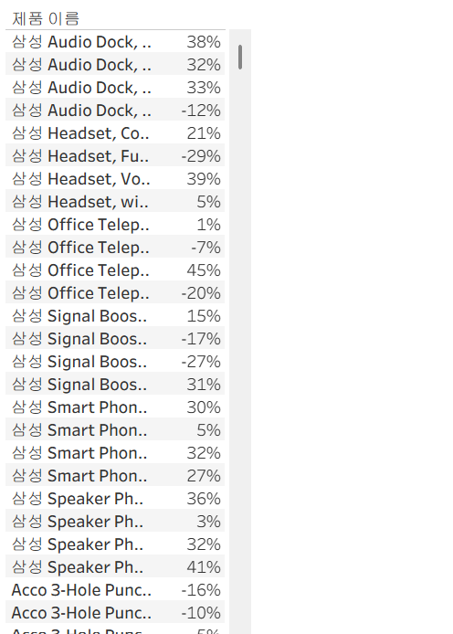

## 34. 행수준계산

기본 계산은 행수준 계산과 집계 계산으로 나뉘어짐

데이터의 각 레코드를 통해 계산하는 방식

고객의 성과 이름 분리 
1. 계산된 필드 만들기
2. SPLIT([고객 이름], ' ' , 1 ) 고객 이름만 분리
3. SPLIT([고객 이름], ' ' , 2 ) 고객 성만 분리

<제품별 수익성 확인>
제품 이름 행으로 
수익성 필드 만들고 필드 행 선반에 드래그 앤 드롭 
if [수익] > 0 THEN '수익성 있음'
ELSEIF [수익] <0 THEN '수익성 없음'
ELSE '손익 평형'
END

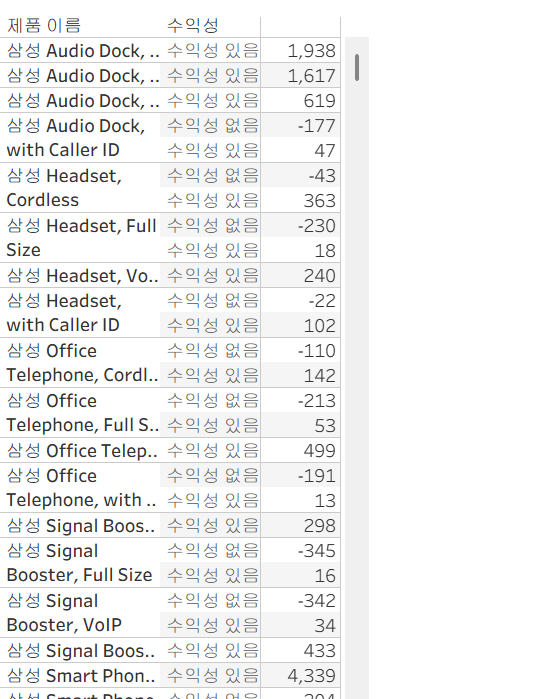


<주문처리일수 필드 만들기>
주문 id 주문날짜 배송날짜 행으로 옮기고
주문날짜&배송날짜 마우스 우클릭 -> 더보기 -> 사용자 지정 날짜 -> 연도/월/일 
주문처리일수 마크 카드 텍스트 위로 드래그 앤 드롭  
DATEDIFF('day',[주문 날짜],[배송 날짜])

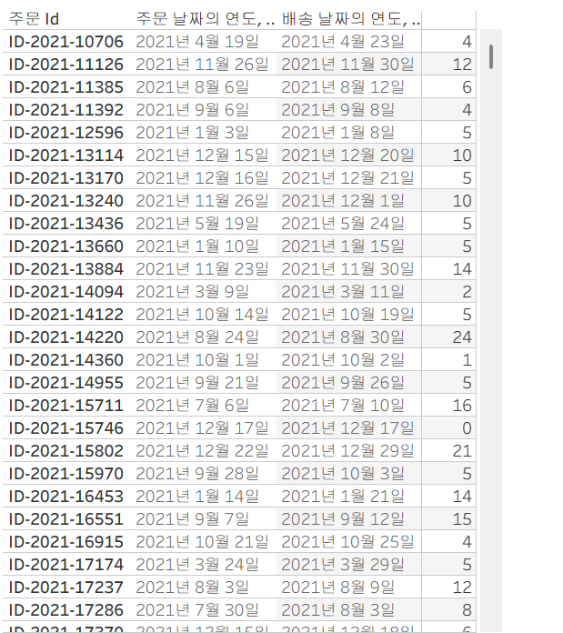


주문처리 일수 4일로 나타나야 하는데 12일로 나타나는 이유? 
-> 일부 주문 id 들이 여러 개의 제품 레코드를 가지고 있어서 계산된 필드에서 일 수를 전부 합계해버리기 때문에 해당 필드를 측정값에서 차원 값으로 변경해서 사용해야함 

주문처리 일수 마우스 우클릭 -> 차원으로 변환 후 다시 행으로 드래그 앤 드롭 -> 수정 완료 ! 


## 35. 집계계산

현재 뷰에서 보이는 기준으로 계산하는 방식

1. 집계 계산식을 통해 계산된 필드 만들기 
SUM([매출]) 합계 매출 집계 계산
사용자가 집계 계산된 필드를 만들면 해당 필드에 '집계'를 나타내고 마우스 우클릭 변경 불가능 (계산 수단 옵션 x)

태블로에서 매출 더블클릭시 자동으로 만들어지는 필드 -> '합계'표시로 나타남 
마우스 우클릭시 집계 변경  가능 

<연도별 주문건수 확인 >
고유 주문건수 
COUNTD([주문 Id]) 

고유주문건수 행 주문날짜 열로 드래그 앤 드롭 

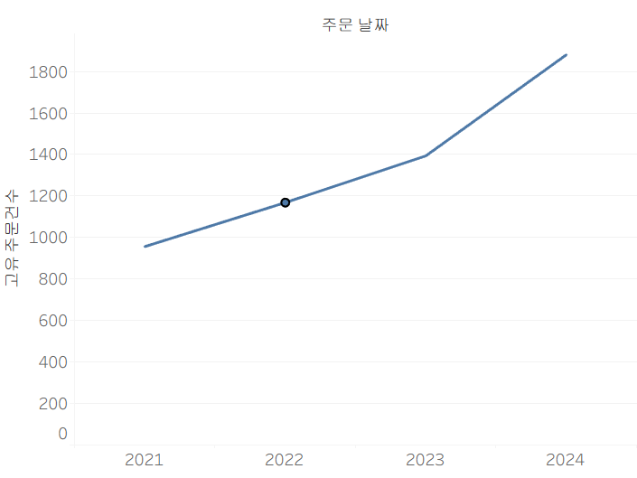
 

## 36. 테이블계산

뷰에 보이는 내용을 바탕으로 데이터가 계산

계산된 필드 만들기 -> 테이블 계산 

<월마다 연도 따라 누적 매출 찾기>
누적 매출 RUNNING_SUM(SUM([매출])) 
기본 설정 -> 테이블(옆으로 계산)
열 주문 날짜 (년도) 행 주문 날짜 (분기, 월)
테이블 계산 방식 바꾸고 싶으면 누적 매출 우클릭 테이블 계산 편집 or 계산 대상 클릭해서 바꾸기 

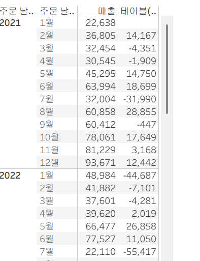

<현재 달과 전월의 차이 알아보기 >
주문 날짜 필드의 년과 월 행 선반에 표시
매출 필드 더블 클릭 
계산된 필드 만들기 
SUM([매출])-LOOKUP(SUM([매출]), -1)
-> 해당 필드 더블 클릭하면 현재달과 전월의 차이 보여줌 

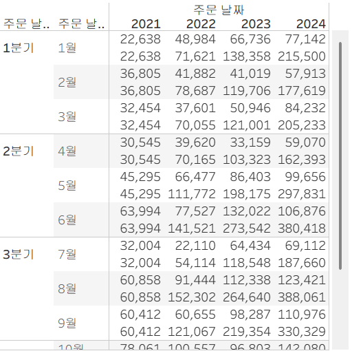

## 37. 퀵테이블계산(1)

퀵 테이블 계산이란?
테이블 계산에서 가장 자주 쓰이는 테이블 계산 유형들을 클릭만으로 가능하도록 만들어 놓은 기능 

누계: 집계한 값을 누적한 값으로 한 번 더 집계해주는 계산 유형 

<분기별 누적 매출&월별 매출 차트 만들기>
1. 주문 날짜 필드 마우스 우클릭해서 열 선반에 드래그 -> 필드 놓기 창에서 연속형 분기(주문 날짜) 더블 클릭 
2. 매출 필드 행 선반 위로 드래그 앤 드롭 
3. 매출 ctrl 눌러서 복제하고 마우스 우클릭 -> 퀵 테이블 계산 -> 누계 
필드 옆에 세모표시: 테이블 계산 되어있다는 뜻 
4. 이중축 적용 
마우스 우클릭 -> 이중축 -> 마우스 우클릭 -> 축 동기화 
각각의 누적 매출과 월별 매출 동시 확인 가능

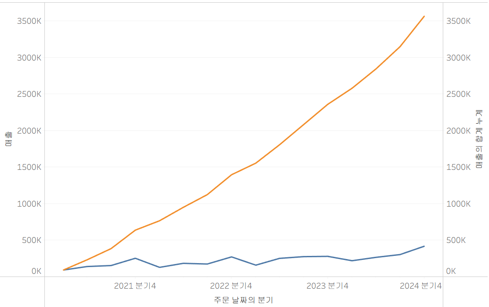

추가로 퀵 테이블 계산이 적용된 필드를 더블 클릭하면 적용된 함수 확인 가능 

<각 제품에 대한 연도별 매출 차이 알아보기>
1. 주문 날짜 필드 열 선반, 범주 필드 행 선반, 매출 필드 마크 카드 텍스트 위에 드래그 앤 드롭 
2. 매출 필드 마우스 우클릭 -> 퀵 테이블 계산 -> 차이 
차이란? 측정값이 기준 값과 어느 정도 차이가 나는지 구하는 계산 유형
기준값 : 이전(기본), 옵션 : 이전, 다음, 첫번째, 지난  

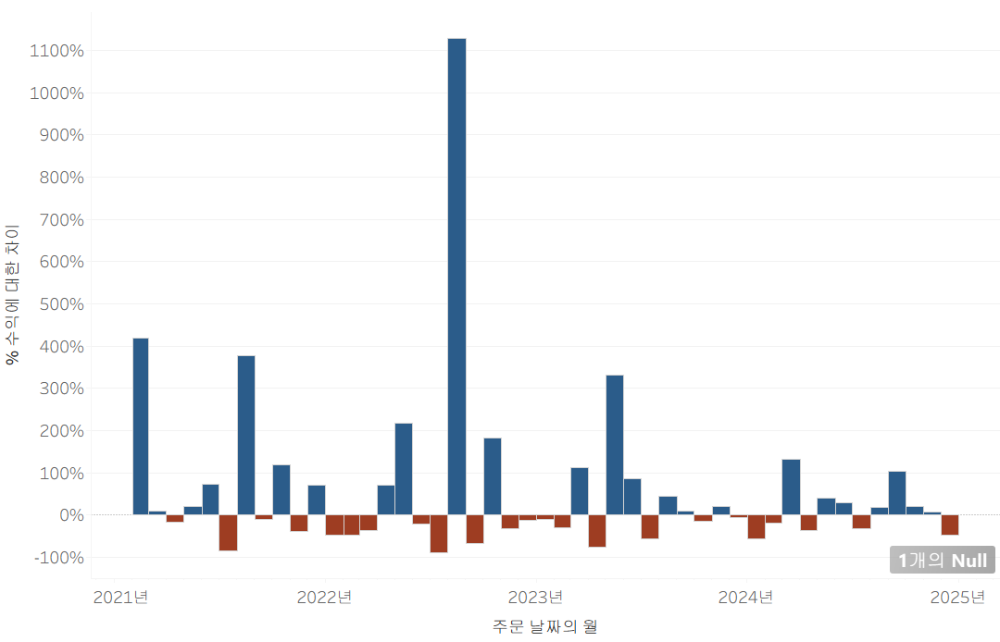

비율 차이란? 측정값들 사이의 성장률 또는 % 차이 
<월별 수익 차이 %로 보려면 ? >
1. 주문 날짜 필드 마우스 우 클릭해 열 선반에 드래그 앤 드롭 -> 연속형 월(주문날짜) 더블 클릭 
2. 수익 필드 행 선반에 드래그 앤 드롭 -> 우클릭 후 퀵테이블 계산 -> 비율 차이 
3. 라인 -> 막대 그래프로 변경 
4. 색상 표현: 행 선반에 있는 수익 필드 ctrl 누른채 마우스로 마크 카드 색상 위로 끌어다 놓기 
5. 범례 색상 편집 : 범례 더블 클릭시 색상 편집 창 나타남 -> 단계별 색상 체크 & 2단계로 설정 
-> 차트에 0을 기준으로 지난 달에 비해 이번 달에 얼마나 수익을 냈는지 가시성이 더 좋아짐 

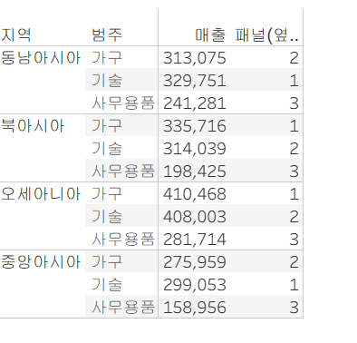

<지역별 제품 매출 순위>
1. 지역 & 범주 필드 행 선반에 드래그 앤 드롭 . 매출 필드 더블 클릭 
2. 마크 선반에 있는 매출 필드에 기호 클릭 -> 퀵 테이블 계산 -> 순위 선택 -> 세모 클릭 -> 계산 대상 패널 (옆에서 아래로)


<지역별 제품 매출 구성 비율>
데이터 패널에서 매출 필드 더블 클릭 
-> 측정값 선반에 있는 퀵 테이블 계산이 적용되지 않은 필드의 기호 클릭 -> 퀵 테이블 계산 -> 구성 비율 -> 세모 클릭 -> 계산 대상 패널 (아래로)

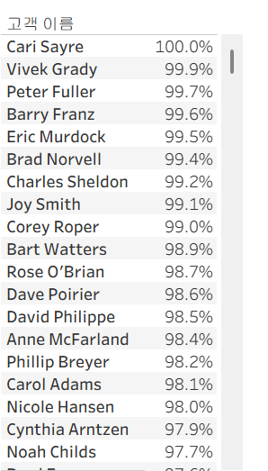

백분위수 : 전체에서 각 멤버들의 백분위 표시
<매출이 많은 고객과 적은 고객 확인>
1. 고객 이름 필드 행 선반, 매출 필드 더블 클릭 
2. 마크 선반에서 매출 필드 위로 마우스 우클릭 -> 퀵 테이블 계산 -> 백분위수 
-> 상단 툴바에서 내림차순 클릭해 정렬하면 매출이 가장 많은 기록한 고객이 100%  오름차순으로 정렬하면 매출이 가장 적은 고객은 0%로 표시됨 

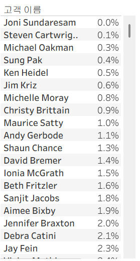

## 38. 퀵테이블계산(2)

<!-- 이동평균, YTD 총계, 전년 대비 성장률, YTD 성장률 등 본 강의에서 알게 된 점을 적어주세요. -->

## 문제 1.

규석이는 이제껏 매출을 올리는 데에 힘썼었지만, 왠지 모르게 주머니에 들어오는 돈이 없어 속상합니다. 

그래서 매출이 상위 20곳에 속하지만, 수익률(%)이 마이너스인 시/도를 확인하려고 합니다.

> 수익률은 SUM([수익]) / SUM([매출])로 정의합니다.

어떤 집합을 만들었고, 어떤 결합을 하였는지를 중심으로 기술하고, 결과 자료를 첨부해주세요. 

(텍스트 표 형태이며, 색상으로 위 집합을 구분할 수 있게 만들어주세요.)

<!-- 아래 예시 이미지를 삭제하고, 직접 만든 시트 사진을 올려주세요. 시트의 이름은 본인 이름으로 기입해주세요-->


## 문제 2.
선희는 주문 Id별로 주문에서 배송까지에 걸리는 날짜 일수가 궁금했습니다. 
그래서 주문 ID별로 주문에서 배송까지 걸리는 일자를 '배송까지 걸린 일수'라는 계산된 필드로 만들고, 이를 마크에 올린 후 확인해보았습니다. 
이때, 계산된 필드의 식은 'DATEDIFF' 함수를 이용하였습니다.

배송까지 걸린 일수 계산을 위한 DATEDIFF 함수 수식을 적어주세요.

```
여기에 답을 적어주세요!
```


그런데 위 그림처럼 '주문 날짜'와 '배송 날짜'를 함께 행에 올려 확인해보니, 주문날짜와 배송날짜의 차이가 '배송까지 걸린 일수'와 다릅니다.

ID-2021-11126을 보니, 11월 26일 배송에 11월 30일 배송이면 4일 차이인데, 12일이 걸렸다고 하네요. 왜 이런 문제가 생긴걸까요?

```
여기에 답을 적어주세요!
```

그리고 이를 해결하기 위해서는 어떻게 해야 할까요?

```
여기에 답을 적어주세요!
```


## 문제 3.

다음은 Tableau의 다양한 계산을 사용할 수 있는 경우를 빈칸으로 두고 문제를 작성한 것입니다. 각 빈칸에 적합한 계산 유형을 채워보세요.

보기
> **누계, 차이, 비율 차이, 구성 비율, 순위, 백분위수, 이동 평균, YTD 총계, 통합 성장률, 전년 대비 성장률, YTD 성장률**

| 계산 유형               | 설명                                                                 | 사용 예시                                                                                          |
|-------------------------|----------------------------------------------------------------------|-----------------------------------------------------------------------------------------------------|
| 여기에 적으세요           | 데이터의 누적 합계를 계산                                             | 한 기업이 월별 매출 데이터를 누적하여 연간 매출 추이를 보고 싶을 때 사용                                      |
| ____________            | 연속 데이터 포인트 간의 차이를 계산                                    | 한 기업이 월별 매출 데이터에서 전월 대비 매출 증감량을 분석하고 싶은 경우                                        |
| ____________            | 연속 데이터 포인트 간의 비율 변화를 계산                               | 한 기업이 월별 매출 데이터에서 전월 대비 매출 증감률(%)을 분석하고 싶은 경우                                      |
| ____________            | 전체에서 각 데이터 포인트의 비율을 계산                                | 한 기업이 전체 매출에서 각 제품군이 차지하는 비율을 보고 싶을 때 사용                                           |
| ____________            | 데이터의 순위를 매깁니다                                              | 한 기업이 제품별 매출 데이터를 순위별로 정렬하여 상위 10개 제품을 분석하고 싶은 경우                              |
| ____________            | 데이터의 백분위를 계산                                               | 한 기업이 고객별 구매 금액 데이터를 백분위수로 나누어 상위 25% 고객을 분석하고 싶은 경우                          |
| ____________            | 일정 기간의 평균을 계산                                               | 한 기업이 주간 매출 데이터에서 4주 이동 평균을 계산하여 트렌드를 분석하고 싶은 경우                              |
| ____________            | 연초부터 현재까지의 총계를 계산                                      | 한 기업이 월별 매출 데이터를 연초부터 현재까지 누적하여 연간 매출 목표 달성 여부를 분석하고 싶은 경우             |
| ____________            | 일정 기간 동안의 연평균 성장률을 계산                                  | 한 기업이 5년 간 매출 데이터를 바탕으로 연평균 성장률(CAGR)을 계산하고 싶은 경우                                  |
| ____________            | 전년 동기간 대비 성장률을 계산                                        | 한 기업이 월별 매출 데이터에서 전년 동월 대비 매출 성장률을 분석하고 싶은 경우                                    |
| ____________            | 연초부터 현재까지의 성장률을 계산                                     | 한 기업이 올해 연초부터 현재까지의 매출이 전년 동기 대비 얼마나 성장했는지 분석하고 싶은 경우                     |

> 사용 예시를 참고하여 실제 경우처럼 생각하며 고민해보아요!